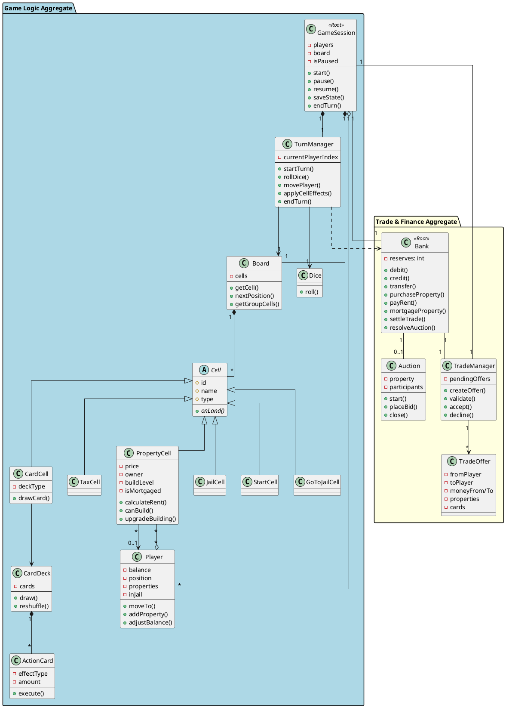

```plantuml
@startuml
skinparam linetype ortho

package "Trade & Finance Aggregate" #LightYellow {
  
  class Bank <<Root>> {
    - reserves: int
    --
    + debit()
    + credit()
    + transfer()
    + purchaseProperty()
    + payRent()
    + mortgageProperty()
    + settleTrade()
    + resolveAuction()
  }
  
  class TradeManager {
    - pendingOffers
    --
    + createOffer()
    + validate()
    + accept()
    + decline()
  }
  
  class TradeOffer {
    - fromPlayer
    - toPlayer
    - moneyFrom/To
    - properties
    - cards
  }
  
  class Auction {
    - property
    - participants
    --
    + start()
    + placeBid()
    + close()
  }
}

package "Game Logic Aggregate" #LightBlue {
  
  class GameSession <<Root>> {
    - players
    - board
    - isPaused
    --
    + start()
    + pause()
    + resume()
    + saveState()
    + endTurn()
  }
  
  class TurnManager {
    - currentPlayerIndex
    --
    + startTurn()
    + rollDice()
    + movePlayer()
    + applyCellEffects()
    + endTurn()
  }
  
  class Board {
    - cells
    --
    + getCell()
    + nextPosition()
    + getGroupCells()
  }
  
  abstract Cell {
    # id
    # name
    # type
    --
    + {abstract} onLand()
  }
  
  class PropertyCell {
    - price
    - owner
    - buildLevel
    - isMortgaged
    --
    + calculateRent()
    + canBuild()
    + upgradeBuilding()
  }
  
  class CardCell {
    - deckType
    --
    + drawCard()
  }
  
  class CardDeck {
    - cards
    --
    + draw()
    + reshuffle()
  }
  
  class ActionCard {
    - effectType
    - amount
    --
    + execute()
  }
  
  class Player {
    - balance
    - position
    - properties
    - inJail
    --
    + moveTo()
    + addProperty()
    + adjustBalance()
  }
  
  class Dice {
    + roll()
  }
  
  class TaxCell
  class JailCell
  class StartCell
  class GoToJailCell
}

' Relationships
Bank "1" -- "1" TradeManager
TradeManager "1" --> "*" TradeOffer
Bank "1" -- "0..1" Auction

GameSession "1" *-- "1" Board
GameSession "1" *-- "1" TurnManager
GameSession "1" o-- "*" Player
GameSession "1" -- "1" Bank
GameSession "1" -- "1" TradeManager

TurnManager --> "1" Dice
TurnManager --> "1" Board
TurnManager ..> Bank

Board "1" *-- "*" Cell

Cell <|-- PropertyCell
Cell <|-- CardCell
Cell <|-- TaxCell
Cell <|-- JailCell
Cell <|-- StartCell
Cell <|-- GoToJailCell

PropertyCell "*" --> "0..1" Player
CardCell --> CardDeck
CardDeck "1" *-- "*" ActionCard

Player "*" o-- "*" PropertyCell

@enduml
```
