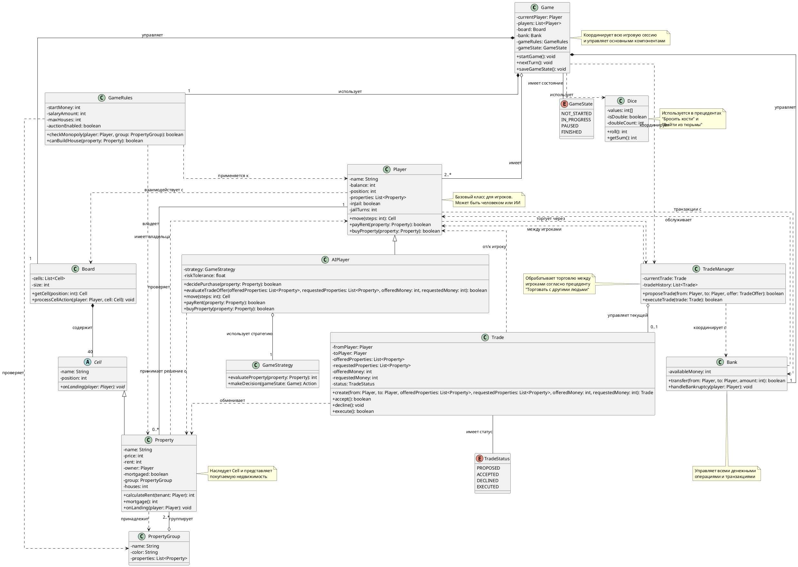

```plantuml
@startuml
skinparam classAttributeIconSize 0
skinparam linetype ortho

class Game {
  - currentPlayer: Player
  - players: List<Player>
  - board: Board
  - bank: Bank
  - gameRules: GameRules
  - gameState: GameState
  + startGame(): void
  + nextTurn(): void
  + saveGameState(): void
}

class Player {
  - name: String
  - balance: int
  - position: int
  - properties: List<Property>
  - inJail: boolean
  - jailTurns: int
  + move(steps: int): Cell
  + payRent(property: Property): boolean
  + buyProperty(property: Property): boolean
}

class Board {
  - cells: List<Cell>
  - size: int
  + getCell(position: int): Cell
  + processCellAction(player: Player, cell: Cell): void
}

abstract class Cell {
  - name: String
  - position: int
  + {abstract} onLanding(player: Player): void
}

class Property {
  - name: String
  - price: int
  - rent: int
  - owner: Player
  - mortgaged: boolean
  - group: PropertyGroup
  - houses: int
  + calculateRent(tenant: Player): int
  + mortgage(): int
  + onLanding(player: Player): void
}

class Bank {
  - availableMoney: int
  + transfer(from: Player, to: Player, amount: int): boolean
  + handleBankruptcy(player: Player): void
}

class Dice {
  - values: int[]
  - isDouble: boolean
  - doubleCount: int
  + roll(): int
  + getSum(): int
}

class GameRules {
  - startMoney: int
  - salaryAmount: int
  - maxHouses: int
  - auctionEnabled: boolean
  + checkMonopoly(player: Player, group: PropertyGroup): boolean
  + canBuildHouse(property: Property): boolean
}

class Trade {
  - fromPlayer: Player
  - toPlayer: Player
  - offeredProperties: List<Property>
  - requestedProperties: List<Property>
  - offeredMoney: int
  - requestedMoney: int
  - status: TradeStatus
  + create(from: Player, to: Player, offeredProperties: List<Property>, requestedProperties: List<Property>, offeredMoney: int, requestedMoney: int): Trade
  + accept(): boolean
  + decline(): void
  + execute(): boolean
}

class TradeManager {
  - currentTrade: Trade
  - tradeHistory: List<Trade>
  + proposeTrade(from: Player, to: Player, offer: TradeOffer): boolean
  + executeTrade(trade: Trade): boolean
}

class AIPlayer {
  - strategy: GameStrategy
  - riskTolerance: float
  + decidePurchase(property: Property): boolean
  + evaluateTradeOffer(offeredProperties: List<Property>, requestedProperties: List<Property>, offeredMoney: int, requestedMoney: int): boolean
  + move(steps: int): Cell
  + payRent(property: Property): boolean
  + buyProperty(property: Property): boolean
}

class PropertyGroup {
  - name: String
  - color: String
  - properties: List<Property>
}

enum GameState {
  NOT_STARTED
  IN_PROGRESS
  PAUSED
  FINISHED
}

enum TradeStatus {
  PROPOSED
  ACCEPTED
  DECLINED
  EXECUTED
}

class GameStrategy {
  + evaluateProperty(property: Property): int
  + makeDecision(gameState: Game): Action
}

Game *-- "1" Board : управляет
Game *-- "1" Bank : управляет
Game *-- "1" GameRules : использует
Game o-- "2..*" Player : имеет
Game ..> Dice : использует
Game ..> TradeManager : координирует

Player "1" -- "0..*" Property : владеет
Player ..> Board : взаимодействует с
Player ..> Bank : транзакции с
Player ..> TradeManager : торгует через

Board *-- "40" Cell : содержит

Cell <|-- Property 

Property ..> PropertyGroup : принадлежит
Property ..> Player : имеет владельца

Bank ..> Player : обслуживает

GameRules ..> Player : применяется к
GameRules ..> Property : проверяет
GameRules ..> PropertyGroup : проверяет

TradeManager o-- "0..1" Trade : управляет текущей
TradeManager ..> Player : между игроками
TradeManager ..> Bank : координирует с

Trade ..> Player : от/к игроку
Trade ..> Property : обменивает
Trade -- TradeStatus : имеет статус

Player <|-- AIPlayer

AIPlayer o-- "1" GameStrategy : использует стратегию
AIPlayer ..> Property : принимает решение о

PropertyGroup o-- "2..*" Property : группирует

Game -- GameState : имеет состояние

note right of Game
  Координирует всю игровую сессию
  и управляет основными компонентами
end note

note right of Player
  Базовый класс для игроков.
  Может быть человеком или ИИ
end note

note right of Property
  Наследует Cell и представляет
  покупаемую недвижимость
end note

note bottom of Bank
  Управляет всеми денежными
  операциями и транзакциями
end note

note left of TradeManager
  Обрабатывает торговлю между
  игроками согласно прецеденту
  "Торговать с другими людьми"
end note

note left of Dice
  Используется в прецедентах
  "Бросить кости" и
  "Выйти из тюрьмы"
end note

@enduml
```
