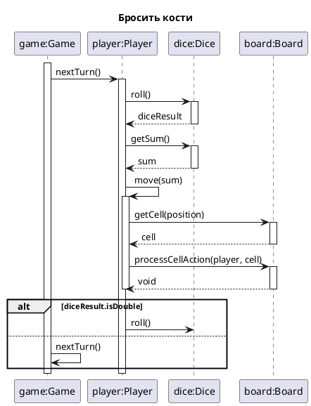

```plantuml
@startuml
title Бросить кости

participant "game:Game" as Game
participant "player:Player" as Player
participant "dice:Dice" as Dice
participant "board:Board" as Board

activate Game
Game -> Player: nextTurn()
activate Player

Player -> Dice: roll()
activate Dice
Dice --> Player: diceResult
deactivate Dice

Player -> Dice: getSum()
activate Dice
Dice --> Player: sum
deactivate Dice

Player -> Player: move(sum)
activate Player
Player -> Board: getCell(position)
activate Board
Board --> Player: cell
deactivate Board

Player -> Board: processCellAction(player, cell)
activate Board
Board --> Player: void
deactivate Board
deactivate Player

alt diceResult.isDouble
    Player -> Dice: roll()
else
    Game -> Game: nextTurn()
end

deactivate Player
deactivate Game

@enduml
```
