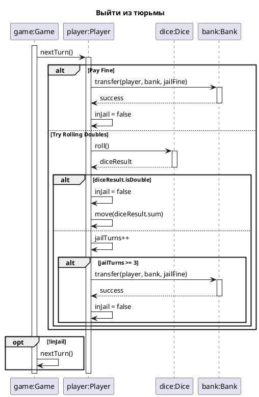

```plantuml
@startuml
title Выйти из тюрьмы

participant "game:Game" as Game
participant "player:Player" as Player
participant "dice:Dice" as Dice
participant "bank:Bank" as Bank

activate Game
Game -> Player: nextTurn()
activate Player

alt Pay Fine
    Player -> Bank: transfer(player, bank, jailFine)
    activate Bank
    Bank --> Player: success
    deactivate Bank
    Player -> Player: inJail = false
else Try Rolling Doubles
    Player -> Dice: roll()
    activate Dice
    Dice --> Player: diceResult
    deactivate Dice
    
    alt diceResult.isDouble
        Player -> Player: inJail = false
        Player -> Player: move(diceResult.sum)
    else
        Player -> Player: jailTurns++
        alt jailTurns >= 3
            Player -> Bank: transfer(player, bank, jailFine)
            activate Bank
            Bank --> Player: success
            deactivate Bank
            Player -> Player: inJail = false
        end
    end
end

opt !inJail
    Game -> Game: nextTurn()
end

deactivate Player
deactivate Game

@enduml
```
