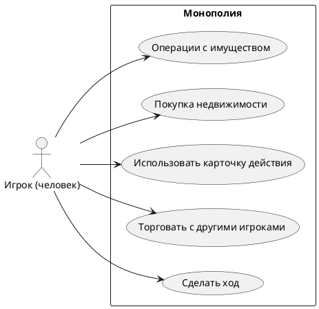

```plantuml
@startuml
left to right direction
skinparam packageStyle rectangle

actor "Игрок (человек)" as Player

rectangle "Монополия" {
  usecase "Операции с имуществом" as RollDice
  usecase "Покупка недвижимости" as BuyProperty
  usecase "Использовать карточку действия" as EscapePrison
  usecase "Торговать с другими игроками" as PayRent
  usecase "Сделать ход" as Trade

  Player --> Trade
  Player --> RollDice
  Player --> EscapePrison
  Player --> PayRent
  Player --> BuyProperty
}

@enduml
```
