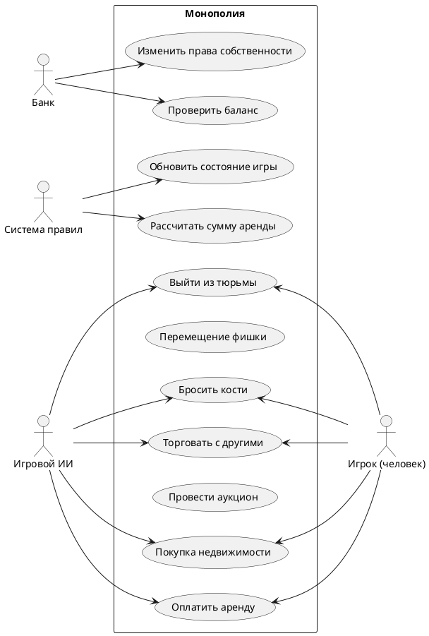

```plantuml
@startuml
left to right direction
skinparam packageStyle rectangle

actor "Игрок (человек)" as Player
actor "Банк" as Bank
actor "Система правил" as Rules
actor "Игровой ИИ" as AI

rectangle "Монополия" {
  usecase "Бросить кости" as RollDice
  usecase "Выйти из тюрьмы" as EscapePrison
  usecase "Оплатить аренду" as PayRent
  usecase "Покупка недвижимости" as BuyProperty
  usecase "Торговать с другими" as Trade
  usecase "Перемещение фишки" as MoveToken
  usecase "Рассчитать сумму аренды" as CalculateRent
  usecase "Проверить баланс" as CheckBalance
  usecase "Провести аукцион" as Auction
  usecase "Изменить права собственности" as ChangeOwnership
  usecase "Обновить состояние игры" as UpdateGameState

  Player -up-> RollDice
  Player -up-> EscapePrison
  Player -up-> PayRent
  Player -up-> BuyProperty
  Player -up-> Trade
  AI --> RollDice
  AI --> EscapePrison
  AI --> PayRent
  AI --> BuyProperty
  AI --> Trade

  Bank --> CheckBalance
  Bank --> ChangeOwnership

  Rules --> UpdateGameState
  Rules --> CalculateRent
}

@enduml
```
