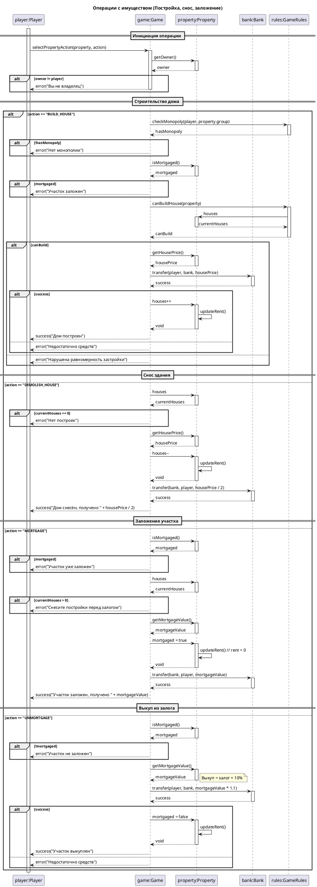

```plantuml
@startuml
title Операции с имуществом (Постройка, снос, заложение)

participant "player:Player" as Player
participant "game:Game" as Game
participant "property:Property" as Property
participant "bank:Bank" as Bank
participant "rules:GameRules" as Rules

== Инициация операции ==
activate Player
Player -> Game: selectPropertyAction(property, action)
activate Game

Game -> Property: getOwner()
activate Property
Property --> Game: owner
deactivate Property

alt owner != player
    Game --> Player: error("Вы не владелец")
    deactivate Game
end

== Строительство дома ==
alt action == "BUILD_HOUSE"
    Game -> Rules: checkMonopoly(player, property.group)
    activate Rules
    Rules --> Game: hasMonopoly
    deactivate Rules
    
    alt !hasMonopoly
        Game --> Player: error("Нет монополии")
        deactivate Game
    end
    
    Game -> Property: isMortgaged()
    activate Property
    Property --> Game: mortgaged
    deactivate Property
    
    alt mortgaged
        Game --> Player: error("Участок заложен")
        deactivate Game
    end
    
    Game -> Rules: canBuildHouse(property)
    activate Rules
    Rules -> Property: houses
    activate Property
    Property --> Rules: currentHouses
    deactivate Property
    Rules --> Game: canBuild
    deactivate Rules
    
    alt canBuild
        Game -> Property: getHousePrice()
        activate Property
        Property --> Game: housePrice
        deactivate Property
        
        Game -> Bank: transfer(player, bank, housePrice)
        activate Bank
        Bank --> Game: success
        deactivate Bank
        
        alt success
            Game -> Property: houses++
            activate Property
            Property -> Property: updateRent()
            Property --> Game: void
            deactivate Property
            
            Game --> Player: success("Дом построен")
        else
            Game --> Player: error("Недостаточно средств")
        end
    else
        Game --> Player: error("Нарушена равномерность застройки")
    end

== Снос здания ==
else action == "DEMOLISH_HOUSE"
    Game -> Property: houses
    activate Property
    Property --> Game: currentHouses
    deactivate Property
    
    alt currentHouses == 0
        Game --> Player: error("Нет построек")
        deactivate Game
    end
    
    Game -> Property: getHousePrice()
    activate Property
    Property --> Game: housePrice
    deactivate Property
    
    Game -> Property: houses--
    activate Property
    Property -> Property: updateRent()
    Property --> Game: void
    deactivate Property
    
    Game -> Bank: transfer(bank, player, housePrice / 2)
    activate Bank
    Bank --> Game: success
    deactivate Bank
    
    Game --> Player: success("Дом снесён, получено " + housePrice / 2)

== Заложение участка ==
else action == "MORTGAGE"
    Game -> Property: isMortgaged()
    activate Property
    Property --> Game: mortgaged
    deactivate Property
    
    alt mortgaged
        Game --> Player: error("Участок уже заложен")
        deactivate Game
    end
    
    Game -> Property: houses
    activate Property
    Property --> Game: currentHouses
    deactivate Property
    
    alt currentHouses > 0
        Game --> Player: error("Снесите постройки перед залогом")
        deactivate Game
    end
    
    Game -> Property: getMortgageValue()
    activate Property
    Property --> Game: mortgageValue
    deactivate Property
    
    Game -> Property: mortgaged = true
    activate Property
    Property -> Property: updateRent() // rent = 0
    Property --> Game: void
    deactivate Property
    
    Game -> Bank: transfer(bank, player, mortgageValue)
    activate Bank
    Bank --> Game: success
    deactivate Bank
    
    Game --> Player: success("Участок заложен, получено " + mortgageValue)

== Выкуп из залога ==
else action == "UNMORTGAGE"
    Game -> Property: isMortgaged()
    activate Property
    Property --> Game: mortgaged
    deactivate Property
    
    alt !mortgaged
        Game --> Player: error("Участок не заложен")
        deactivate Game
    end
    
    Game -> Property: getMortgageValue()
    activate Property
    Property --> Game: mortgageValue
    deactivate Property
    
    note right: Выкуп = залог + 10%
    Game -> Bank: transfer(player, bank, mortgageValue * 1.1)
    activate Bank
    Bank --> Game: success
    deactivate Bank
    
    alt success
        Game -> Property: mortgaged = false
        activate Property
        Property -> Property: updateRent()
        Property --> Game: void
        deactivate Property
        
        Game --> Player: success("Участок выкуплен")
    else
        Game --> Player: error("Недостаточно средств")
    end
end

deactivate Game
deactivate Player

@enduml
```
