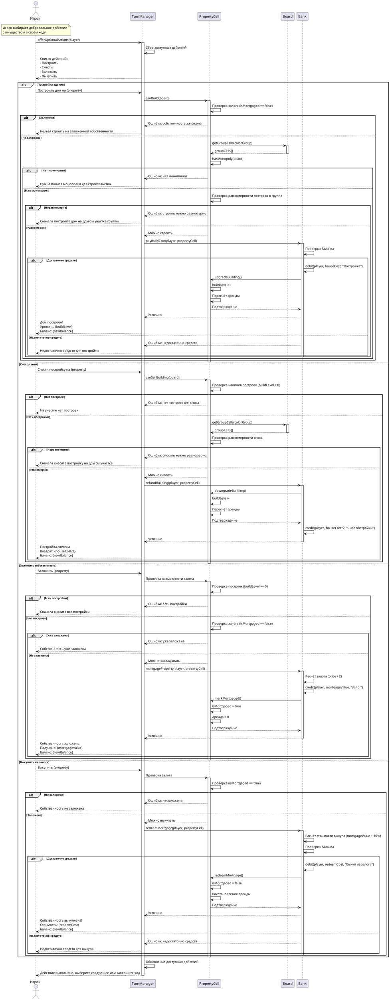

```plantuml
@startuml
actor "Игрок" as Player
participant "TurnManager" as TM
participant "PropertyCell" as PC
participant "Board" as Board
participant "Bank" as Bank

note over Player: Игрок выбирает добровольное действие\nс имуществом в своём ходу

Player -> TM: offerOptionalActions(player)
activate TM
TM -> TM: Сбор доступных действий
TM --> Player: Список действий:\n- Построить\n- Снести\n- Заложить\n- Выкупить

alt Постройка здания
    Player -> TM: Построить дом на {property}
    TM -> PC: canBuild(board)
    activate PC
    PC -> PC: Проверка залога (isMortgaged == false)
    alt Заложена
        PC --> TM: Ошибка: собственность заложена
        TM --> Player: Нельзя строить на заложенной собственности
    else Не заложена
        PC -> Board: getGroupCells(colorGroup)
        activate Board
        Board --> PC: groupCells[]
        deactivate Board
        PC -> PC: hasMonopoly(board)
        alt Нет монополии
            PC --> TM: Ошибка: нет монополии
            TM --> Player: Нужна полная монополия для строительства
        else Есть монополия
            PC -> PC: Проверка равномерности построек в группе
            alt Неравномерно
                PC --> TM: Ошибка: строить нужно равномерно
                TM --> Player: Сначала постройте дом на другом участке группы
            else Равномерно
                PC --> TM: Можно строить
                TM -> Bank: payBuildCost(player, propertyCell)
                activate Bank
                Bank -> Bank: Проверка баланса
                alt Достаточно средств
                    Bank -> Bank: debit(player, houseCost, "Постройка")
                    Bank -> PC: upgradeBuilding()
                    PC -> PC: buildLevel++
                    PC -> PC: Пересчёт аренды
                    PC --> Bank: Подтверждение
                    Bank --> TM: Успешно
                    TM --> Player: Дом построен!\nУровень: {buildLevel}\nБаланс: {newBalance}
                else Недостаточно средств
                    Bank --> TM: Ошибка: недостаточно средств
                    TM --> Player: Недостаточно средств для постройки
                end
                deactivate Bank
            end
        end
    end
    deactivate PC

else Снос здания
    Player -> TM: Снести постройку на {property}
    TM -> PC: canSellBuilding(board)
    activate PC
    PC -> PC: Проверка наличия построек (buildLevel > 0)
    alt Нет построек
        PC --> TM: Ошибка: нет построек для сноса
        TM --> Player: На участке нет построек
    else Есть постройки
        PC -> Board: getGroupCells(colorGroup)
        activate Board
        Board --> PC: groupCells[]
        deactivate Board
        PC -> PC: Проверка равномерности сноса
        alt Неравномерно
            PC --> TM: Ошибка: сносить нужно равномерно
            TM --> Player: Сначала снесите постройку на другом участке
        else Равномерно
            PC --> TM: Можно сносить
            TM -> Bank: refundBuilding(player, propertyCell)
            activate Bank
            Bank -> PC: downgradeBuilding()
            PC -> PC: buildLevel--
            PC -> PC: Пересчёт аренды
            PC --> Bank: Подтверждение
            Bank -> Bank: credit(player, houseCost/2, "Снос постройки")
            Bank --> TM: Успешно
            deactivate Bank
            TM --> Player: Постройка снесена\nВозврат: {houseCost/2}\nБаланс: {newBalance}
        end
    end
    deactivate PC

else Заложить собственность
    Player -> TM: Заложить {property}
    TM -> PC: Проверка возможности залога
    activate PC
    PC -> PC: Проверка построек (buildLevel == 0)
    alt Есть постройки
        PC --> TM: Ошибка: есть постройки
        TM --> Player: Сначала снесите все постройки
    else Нет построек
        PC -> PC: Проверка залога (isMortgaged == false)
        alt Уже заложена
            PC --> TM: Ошибка: уже заложена
            TM --> Player: Собственность уже заложена
        else Не заложена
            PC --> TM: Можно закладывать
            TM -> Bank: mortgageProperty(player, propertyCell)
            activate Bank
            Bank -> Bank: Расчёт залога (price / 2)
            Bank -> Bank: credit(player, mortgageValue, "Залог")
            Bank -> PC: markMortgaged()
            PC -> PC: isMortgaged = true
            PC -> PC: Аренда = 0
            PC --> Bank: Подтверждение
            Bank --> TM: Успешно
            deactivate Bank
            TM --> Player: Собственность заложена\nПолучено: {mortgageValue}\nБаланс: {newBalance}
        end
    end
    deactivate PC

else Выкупить из залога
    Player -> TM: Выкупить {property}
    TM -> PC: Проверка залога
    activate PC
    PC -> PC: Проверка (isMortgaged == true)
    alt Не заложена
        PC --> TM: Ошибка: не заложена
        TM --> Player: Собственность не заложена
    else Заложена
        PC --> TM: Можно выкупать
        TM -> Bank: redeemMortgage(player, propertyCell)
        activate Bank
        Bank -> Bank: Расчёт стоимости выкупа (mortgageValue + 10%)
        Bank -> Bank: Проверка баланса
        alt Достаточно средств
            Bank -> Bank: debit(player, redeemCost, "Выкуп из залога")
            Bank -> PC: redeemMortgage()
            PC -> PC: isMortgaged = false
            PC -> PC: Восстановление аренды
            PC --> Bank: Подтверждение
            Bank --> TM: Успешно
            TM --> Player: Собственность выкуплена!\nСтоимость: {redeemCost}\nБаланс: {newBalance}
        else Недостаточно средств
            Bank --> TM: Ошибка: недостаточно средств
            TM --> Player: Недостаточно средств для выкупа
        end
        deactivate Bank
    end
    deactivate PC
end

TM -> TM: Обновление доступных действий
TM --> Player: Действие выполнено, выберите следующее или завершите ход

deactivate TM

@enduml
```
