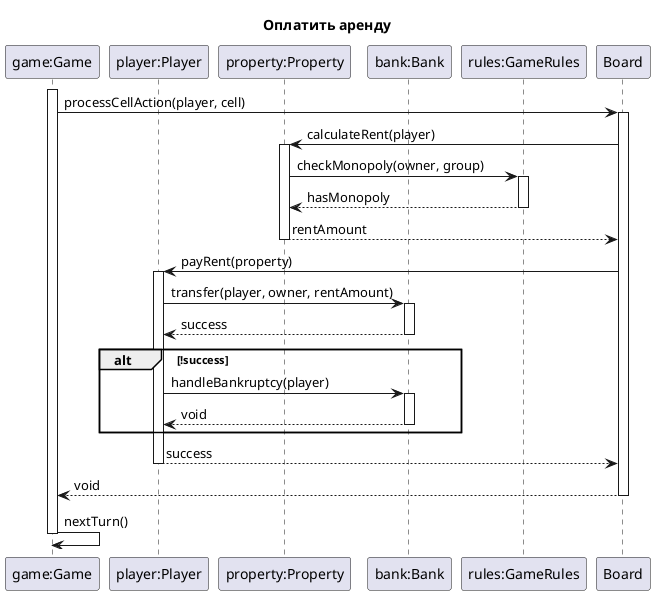

```plantuml
@startuml
title Оплатить аренду

participant "game:Game" as Game
participant "player:Player" as Player
participant "property:Property" as Property
participant "bank:Bank" as Bank
participant "rules:GameRules" as Rules

activate Game
Game -> Board: processCellAction(player, cell)
activate Board

Board -> Property: calculateRent(player)
activate Property

Property -> Rules: checkMonopoly(owner, group)
activate Rules
Rules --> Property: hasMonopoly
deactivate Rules

Property --> Board: rentAmount
deactivate Property

Board -> Player: payRent(property)
activate Player

Player -> Bank: transfer(player, owner, rentAmount)
activate Bank
Bank --> Player: success
deactivate Bank

alt !success
    Player -> Bank: handleBankruptcy(player)
    activate Bank
    Bank --> Player: void
    deactivate Bank
end

Player --> Board: success
deactivate Player

Board --> Game: void
deactivate Board

Game -> Game: nextTurn()
deactivate Game

@enduml
```
