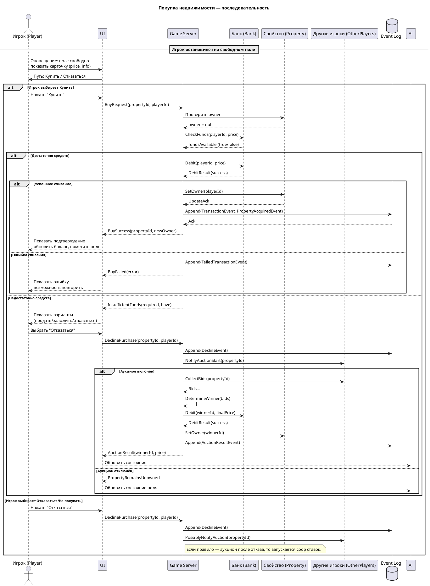

```plantuml
@startuml
title Покупка недвижимости — последовательность

actor "Игрок (Player)" as Player
participant "UI" as UI
participant "Game Server" as Server
participant "Банк (Bank)" as Bank
participant "Свойство (Property)" as Property
participant "Другие игроки (OtherPlayers)" as Others
database "Event Log" as Log

== Игрок остановился на свободном поле ==
Player -> UI : Оповещение: поле свободно\nпоказать карточку (price, info)
UI -> Player : Путь: Купить / Отказаться

alt Игрок выбирает Купить
    Player -> UI : Нажать "Купить"
    UI -> Server : BuyRequest(propertyId, playerId)
    Server -> Property : Проверить owner
    Property --> Server : owner = null
    Server -> Bank : CheckFunds(playerId, price)
    Bank --> Server : fundsAvailable (true/false)

    alt Достаточно средств
        Server -> Bank : Debit(playerId, price)
        Bank --> Server : DebitResult(success)
        alt Успешное списание
            Server -> Property : SetOwner(playerId)
            Property --> Server : UpdateAck
            Server -> Log : Append(TransactionEvent, PropertyAcquiredEvent)
            Log --> Server : Ack
            Server --> UI : BuySuccess(propertyId, newOwner)
            UI --> Player : Показать подтверждение\nобновить баланс, пометить поле
        else Ошибка списания
            Server -> Log : Append(FailedTransactionEvent)
            Server --> UI : BuyFailed(error)
            UI --> Player : Показать ошибку\nвозможность повторить
        end
    else Недостаточно средств
        Server --> UI : InsufficientFunds(required, have)
        UI --> Player : Показать варианты\n(продать/заложить/отказаться)
        Player -> UI : Выбрать "Отказаться"
        UI -> Server : DeclinePurchase(propertyId, playerId)
        Server -> Log : Append(DeclineEvent)
        Server -> Others : NotifyAuctionStart(propertyId)
        alt Аукцион включён
            Server -> Others : CollectBids(propertyId)
            Others -> Server : Bids...
            Server -> Server : DetermineWinner(bids)
            Server -> Bank : Debit(winnerId, finalPrice)
            Bank --> Server : DebitResult(success)
            Server -> Property : SetOwner(winnerId)
            Server -> Log : Append(AuctionResultEvent)
            Server --> UI : AuctionResult(winnerId, price)
            UI --> All : Обновить состояния
        else Аукцион отключён
            Server --> UI : PropertyRemainsUnowned
            UI --> All : Обновить состояние поля
        end
    end
else Игрок выбирает Отказаться/Не покупать
    Player -> UI : Нажать "Отказаться"
    UI -> Server : DeclinePurchase(propertyId, playerId)
    Server -> Log : Append(DeclineEvent)
    Server -> Others : PossiblyNotifyAuction(propertyId)
    note right of Server
      Если правило — аукцион после отказа, то запускается сбор ставок.
    end note
end

@enduml

```
