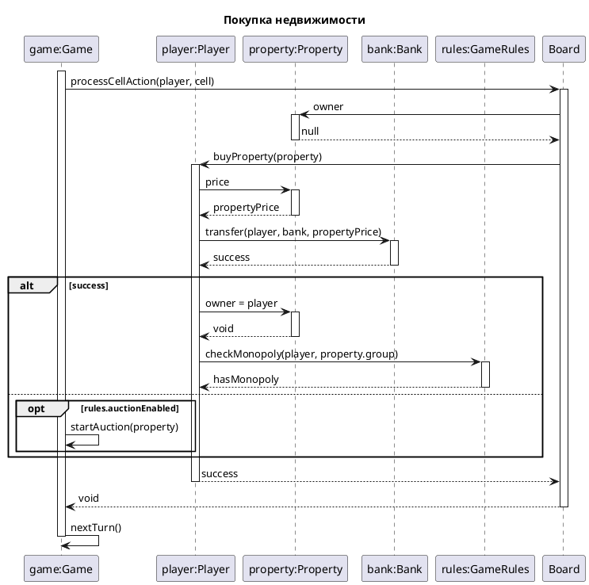

```plantuml
@startuml
title Покупка недвижимости

participant "game:Game" as Game
participant "player:Player" as Player
participant "property:Property" as Property
participant "bank:Bank" as Bank
participant "rules:GameRules" as Rules

activate Game
Game -> Board: processCellAction(player, cell)
activate Board

Board -> Property: owner
activate Property
Property --> Board: null
deactivate Property

Board -> Player: buyProperty(property)
activate Player

Player -> Property: price
activate Property
Property --> Player: propertyPrice
deactivate Property

Player -> Bank: transfer(player, bank, propertyPrice)
activate Bank
Bank --> Player: success
deactivate Bank

alt success
    Player -> Property: owner = player
    activate Property
    Property --> Player: void
    deactivate Property
    
    Player -> Rules: checkMonopoly(player, property.group)
    activate Rules
    Rules --> Player: hasMonopoly
    deactivate Rules
else
    opt rules.auctionEnabled
        Game -> Game: startAuction(property)
    end
end

Player --> Board: success
deactivate Player

Board --> Game: void
deactivate Board

Game -> Game: nextTurn()
deactivate Game

@enduml
```
