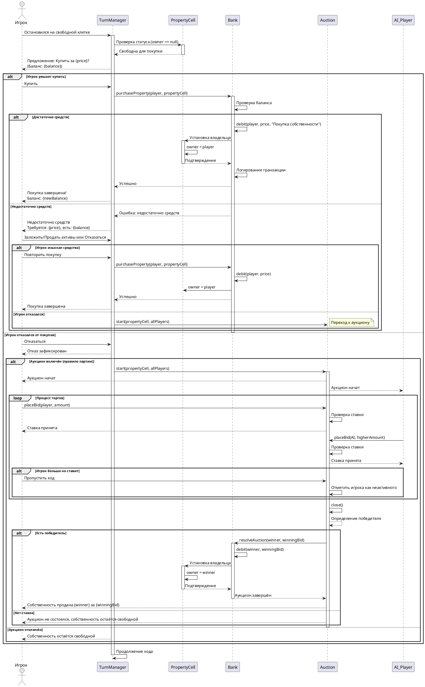

# Диаграмма последовательности: Покупка недвижимости

```plantuml
@startuml
actor "Игрок" as Player
participant "TurnManager" as TM
participant "PropertyCell" as PC
participant "Bank" as Bank
participant "Auction" as Auction
participant "AI_Player" as AI

Player -> TM: Остановился на свободной клетке
activate TM
TM -> PC: Проверка статуса (owner == null)
activate PC
PC --> TM: Свободна для покупки
deactivate PC

TM --> Player: Предложение: Купить за {price}?\n(Баланс: {balance})

alt Игрок решает купить
    Player -> TM: Купить
    TM -> Bank: purchaseProperty(player, propertyCell)
    activate Bank
    Bank -> Bank: Проверка баланса
    alt Достаточно средств
        Bank -> Bank: debit(player, price, "Покупка собственности")
        Bank -> PC: Установка владельца
        activate PC
        PC -> PC: owner = player
        PC --> Bank: Подтверждение
        deactivate PC
        Bank -> Bank: Логирование транзакции
        Bank --> TM: Успешно
        TM --> Player: Покупка завершена!\nБаланс: {newBalance}
    else Недостаточно средств
        Bank --> TM: Ошибка: недостаточно средств
        TM --> Player: Недостаточно средств\nТребуется: {price}, есть: {balance}
        Player -> TM: Заложить/Продать активы или Отказаться
        alt Игрок изыскал средства
            Player -> TM: Повторить покупку
            TM -> Bank: purchaseProperty(player, propertyCell)
            Bank -> Bank: debit(player, price)
            Bank -> PC: owner = player
            Bank --> TM: Успешно
            TM --> Player: Покупка завершена
        else Игрок отказался
            TM -> Auction: start(propertyCell, allPlayers)
            note right: Переход к аукциону
        end
    end
    deactivate Bank
    
else Игрок отказался от покупки
    Player -> TM: Отказаться
    TM --> Player: Отказ зафиксирован
    
    alt Аукцион включён (правило партии)
        TM -> Auction: start(propertyCell, allPlayers)
        activate Auction
        Auction --> Player: Аукцион начат
        Auction --> AI: Аукцион начат
        
        loop Процесс торгов
            Player -> Auction: placeBid(player, amount)
            Auction -> Auction: Проверка ставки
            Auction --> Player: Ставка принята
            
            AI -> Auction: placeBid(AI, higherAmount)
            Auction -> Auction: Проверка ставки
            Auction --> AI: Ставка принята
            
            alt Игрок больше не ставит
                Player -> Auction: Пропустить ход
                Auction -> Auction: Отметить игрока как неактивного
            end
        end
        
        Auction -> Auction: close()
        Auction --> Auction: Определение победителя
        
        alt Есть победитель
            Auction -> Bank: resolveAuction(winner, winningBid)
            activate Bank
            Bank -> Bank: debit(winner, winningBid)
            Bank -> PC: Установка владельца
            activate PC
            PC -> PC: owner = winner
            PC --> Bank: Подтверждение
            deactivate PC
            Bank --> Auction: Аукцион завершён
            deactivate Bank
            Auction --> Player: Собственность продана {winner} за {winningBid}
        else Нет ставок
            Auction --> Player: Аукцион не состоялся, собственность остаётся свободной
        end
        deactivate Auction
    else Аукцион отключён
        TM --> Player: Собственность остаётся свободной
    end
end

TM -> TM: Продолжение хода
deactivate TM

@enduml
```
