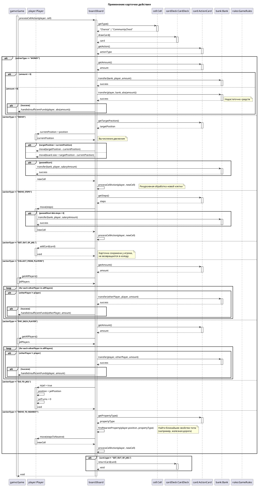

```plantuml
@startuml
title Применение карточки действия

participant "game:Game" as Game
participant "player:Player" as Player
participant "board:Board" as Board
participant "cell:Cell" as Cell
participant "cardDeck:CardDeck" as Deck
participant "card:ActionCard" as Card
participant "bank:Bank" as Bank
participant "rules:GameRules" as Rules

activate Game
Game -> Board: processCellAction(player, cell)
activate Board

Board -> Cell: getType()
activate Cell
Cell --> Board: "Chance" | "CommunityChest"
deactivate Cell

Board -> Deck: drawCard()
activate Deck
Deck --> Board: card
deactivate Deck

Board -> Card: getAction()
activate Card
Card --> Board: actionType
deactivate Card

alt actionType == "MONEY"
    Board -> Card: getAmount()
    activate Card
    Card --> Board: amount
    deactivate Card
    
    alt amount > 0
        Board -> Bank: transfer(bank, player, amount)
        activate Bank
        Bank --> Board: success
        deactivate Bank
    else amount < 0
        Board -> Bank: transfer(player, bank, abs(amount))
        activate Bank
        Bank --> Board: success
        deactivate Bank
        
        alt !success
            note right: Недостаточно средств
            Board -> Game: handleInsufficientFunds(player, abs(amount))
        end
    end
    
else actionType == "MOVE"
    Board -> Card: getTargetPosition()
    activate Card
    Card --> Board: targetPosition
    deactivate Card
    
    Board -> Player: currentPosition = position
    activate Player
    Player --> Board: currentPosition
    deactivate Player
    
    note right: Вычисление движения
    alt targetPosition > currentPosition
        Board -> Player: move(targetPosition - currentPosition)
    else
        Board -> Player: move(board.size + targetPosition - currentPosition)
    end
    
    activate Player
    
    alt passedStart
        Player -> Bank: transfer(bank, player, salaryAmount)
        activate Bank
        Bank --> Player: success
        deactivate Bank
    end
    
    Player --> Board: newCell
    deactivate Player
    
    Board -> Board: processCellAction(player, newCell)
    note right: Рекурсивная обработка новой клетки
    
else actionType == "MOVE_STEPS"
    Board -> Card: getSteps()
    activate Card
    Card --> Board: steps
    deactivate Card
    
    Board -> Player: move(steps)
    activate Player
    
    alt passedStart && steps > 0
        Player -> Bank: transfer(bank, player, salaryAmount)
        activate Bank
        Bank --> Player: success
        deactivate Bank
    end
    
    Player --> Board: newCell
    deactivate Player
    
    Board -> Board: processCellAction(player, newCell)
    
else actionType == "GET_OUT_OF_JAIL"
    Board -> Player: addCard(card)
    activate Player
    Player --> Board: void
    deactivate Player
    
    note right: Карточка сохранена у игрока,\nне возвращается в колоду
    
else actionType == "COLLECT_FROM_PLAYERS"
    Board -> Card: getAmount()
    activate Card
    Card --> Board: amount
    deactivate Card
    
    Board -> Game: getAllPlayers()
    activate Game
    Game --> Board: allPlayers
    deactivate Game
    
    loop for each otherPlayer in allPlayers
        alt otherPlayer != player
            Board -> Bank: transfer(otherPlayer, player, amount)
            activate Bank
            Bank --> Board: success
            deactivate Bank
            
            alt !success
                Board -> Game: handleInsufficientFunds(otherPlayer, amount)
            end
        end
    end
    
else actionType == "PAY_EACH_PLAYER"
    Board -> Card: getAmount()
    activate Card
    Card --> Board: amount
    deactivate Card
    
    Board -> Game: getAllPlayers()
    activate Game
    Game --> Board: allPlayers
    deactivate Game
    
    loop for each otherPlayer in allPlayers
        alt otherPlayer != player
            Board -> Bank: transfer(player, otherPlayer, amount)
            activate Bank
            Bank --> Board: success
            deactivate Bank
            
            alt !success
                Board -> Game: handleInsufficientFunds(player, amount)
            end
        end
    end

else actionType == "GO_TO_JAIL"
    Board -> Player: inJail = true
    activate Player
    Player -> Player: position = jailPosition
    Player -> Player: jailTurns = 0
    Player --> Board: void
    deactivate Player
    
else actionType == "MOVE_TO_NEAREST"
    Board -> Card: getPropertyType()
    activate Card
    Card --> Board: propertyType
    deactivate Card
    
    Board -> Board: findNearestProperty(player.position, propertyType)
    note right: Найти ближайшее свойство типа\n(например, железная дорога)
    
    Board -> Player: move(stepsToNearest)
    activate Player
    Player --> Board: newCell
    deactivate Player
    
    Board -> Board: processCellAction(player, newCell)
end

alt card.type != "GET_OUT_OF_JAIL"
    Board -> Deck: returnCard(card)
    activate Deck
    Deck --> Board: void
    deactivate Deck
end

Board --> Game: void
deactivate Board
deactivate Game

@enduml
```
