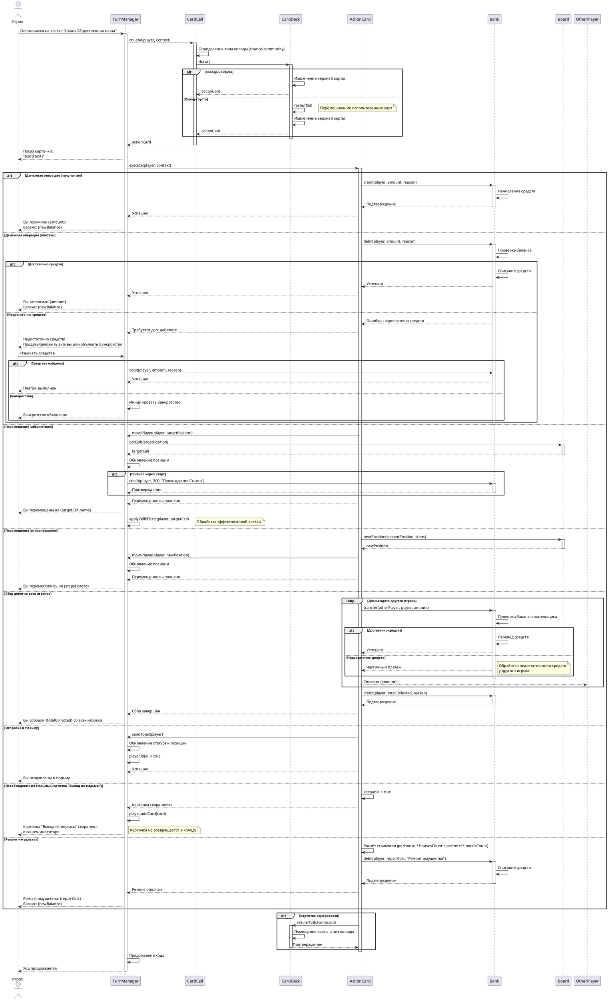

# Диаграмма последовательности: Применение карточки действия

```plantuml
@startuml
actor "Игрок" as Player
participant "TurnManager" as TM
participant "CardCell" as CC
participant "CardDeck" as Deck
participant "ActionCard" as Card
participant "Bank" as Bank
participant "Board" as Board
participant "OtherPlayer" as Other

Player -> TM: Остановился на клетке "Шанс/Общественная казна"
activate TM

TM -> CC: onLand(player, context)
activate CC
CC -> CC: Определение типа колоды (chance/community)
CC -> Deck: draw()
activate Deck

alt Колода не пуста
    Deck -> Deck: Извлечение верхней карты
    Deck --> CC: actionCard
else Колода пуста
    Deck -> Deck: reshuffle()
    note right: Перемешивание использованных карт
    Deck -> Deck: Извлечение верхней карты
    Deck --> CC: actionCard
end
deactivate Deck

CC --> TM: actionCard
deactivate CC

TM --> Player: Показ карточки:\n"{card.text}"

TM -> Card: execute(player, context)
activate Card

alt Денежная операция (получение)
    Card -> Bank: credit(player, amount, reason)
    activate Bank
    Bank -> Bank: Начисление средств
    Bank --> Card: Подтверждение
    deactivate Bank
    Card --> TM: Успешно
    TM --> Player: Вы получили {amount}!\nБаланс: {newBalance}

else Денежная операция (платёж)
    Card -> Bank: debit(player, amount, reason)
    activate Bank
    Bank -> Bank: Проверка баланса
    alt Достаточно средств
        Bank -> Bank: Списание средств
        Bank --> Card: Успешно
        Card --> TM: Успешно
        TM --> Player: Вы заплатили {amount}\nБаланс: {newBalance}
    else Недостаточно средств
        Bank --> Card: Ошибка: недостаточно средств
        Card --> TM: Требуется доп. действие
        TM --> Player: Недостаточно средств!\nПродать/заложить активы или объявить банкротство
        Player -> TM: Изыскать средства
        alt Средства найдены
            TM -> Bank: debit(player, amount, reason)
            Bank --> TM: Успешно
            TM --> Player: Платёж выполнен
        else Банкротство
            TM -> TM: Инициировать банкротство
            TM --> Player: Банкротство объявлено
        end
    end
    deactivate Bank

else Перемещение (абсолютное)
    Card -> TM: movePlayer(player, targetPosition)
    TM -> Board: getCell(targetPosition)
    activate Board
    Board --> TM: targetCell
    deactivate Board
    TM -> TM: Обновление позиции
    alt Прошёл через Старт
        TM -> Bank: credit(player, 200, "Прохождение Старта")
        activate Bank
        Bank --> TM: Подтверждение
        deactivate Bank
    end
    Card --> TM: Перемещение выполнено
    TM --> Player: Вы перемещены на {targetCell.name}
    TM -> TM: applyCellEffects(player, targetCell)
    note right: Обработка эффектов новой клетки

else Перемещение (относительное)
    Card -> Board: nextPosition(currentPosition, steps)
    activate Board
    Board --> Card: newPosition
    deactivate Board
    Card -> TM: movePlayer(player, newPosition)
    TM -> TM: Обновление позиции
    Card --> TM: Перемещение выполнено
    TM --> Player: Вы переместились на {steps} клеток

else Сбор денег со всех игроков
    loop Для каждого другого игрока
        Card -> Bank: transfer(otherPlayer, player, amount)
        activate Bank
        Bank -> Bank: Проверка баланса плательщика
        alt Достаточно средств
            Bank -> Bank: Перевод средств
            Bank --> Card: Успешно
        else Недостаточно средств
            Bank --> Card: Частичный платёж
            note right: Обработка недостаточности средств\nу другого игрока
        end
        deactivate Bank
        Card --> Other: Списано {amount}
    end
    Card -> Bank: credit(player, totalCollected, reason)
    activate Bank
    Bank --> Card: Подтверждение
    deactivate Bank
    Card --> TM: Сбор завершён
    TM --> Player: Вы собрали {totalCollected} со всех игроков

else Отправка в тюрьму
    Card -> TM: sendToJail(player)
    TM -> TM: Обновление статуса и позиции
    TM -> TM: player.inJail = true
    Card --> TM: Успешно
    TM --> Player: Вы отправлены в тюрьму

else Освобождение из тюрьмы (карточка "Выход из тюрьмы")
    Card -> Card: keepable = true
    Card --> TM: Карточка сохраняется
    TM -> TM: player.addCard(card)
    TM --> Player: Карточка "Выход из тюрьмы" сохранена\nв вашем инвентаре
    note right: Карточка не возвращается в колоду

else Ремонт имущества
    Card -> Card: Расчёт стоимости (perHouse * housesCount + perHotel * hotelsCount)
    Card -> Bank: debit(player, repairCost, "Ремонт имущества")
    activate Bank
    Bank -> Bank: Списание средств
    Bank --> Card: Подтверждение
    deactivate Bank
    Card --> TM: Ремонт оплачен
    TM --> Player: Ремонт имущества: {repairCost}\nБаланс: {newBalance}
end

alt Карточка одноразовая
    Card -> Deck: returnToBottom(card)
    activate Deck
    Deck -> Deck: Помещение карты в низ колоды
    Deck --> Card: Подтверждение
    deactivate Deck
end

deactivate Card

TM -> TM: Продолжение хода
TM --> Player: Ход продолжается

deactivate TM

@enduml
```
