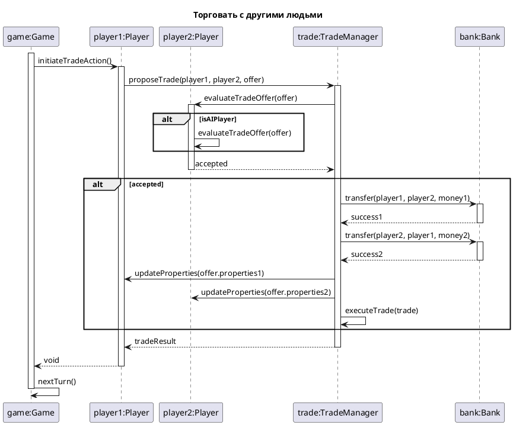

```plantuml
@startuml
title Торговать с другими людьми

participant "game:Game" as Game
participant "player1:Player" as Player1
participant "player2:Player" as Player2
participant "trade:TradeManager" as Trade
participant "bank:Bank" as Bank

activate Game
Game -> Player1: initiateTradeAction()
activate Player1

Player1 -> Trade: proposeTrade(player1, player2, offer)
activate Trade

Trade -> Player2: evaluateTradeOffer(offer)
activate Player2

alt isAIPlayer
    Player2 -> Player2: evaluateTradeOffer(offer)
end

Player2 --> Trade: accepted
deactivate Player2

alt accepted
    Trade -> Bank: transfer(player1, player2, money1)
    activate Bank
    Bank --> Trade: success1
    deactivate Bank
    
    Trade -> Bank: transfer(player2, player1, money2)
    activate Bank
    Bank --> Trade: success2
    deactivate Bank
    
    Trade -> Player1: updateProperties(offer.properties1)
    Trade -> Player2: updateProperties(offer.properties2)
    
    Trade -> Trade: executeTrade(trade)
end

Trade --> Player1: tradeResult
deactivate Trade

Player1 --> Game: void
deactivate Player1

Game -> Game: nextTurn()
deactivate Game

@enduml
```
