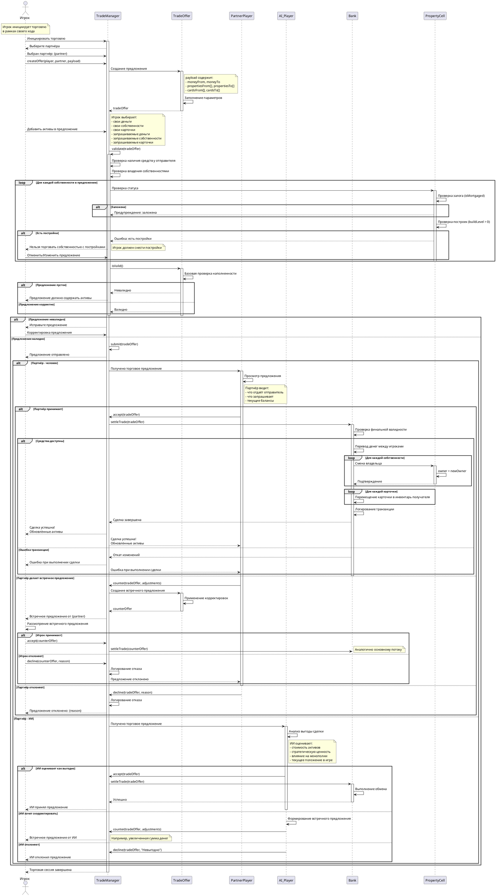

# Диаграмма последовательности: Торговля с другими игроками

```plantuml
@startuml
actor "Игрок" as Player
participant "TradeManager" as TM
participant "TradeOffer" as Offer
participant "PartnerPlayer" as Partner
participant "AI_Player" as AI
participant "Bank" as Bank
participant "PropertyCell" as PC

note over Player: Игрок инициирует торговлю\nв рамках своего хода

Player -> TM: Инициировать торговлю
activate TM
TM --> Player: Выберите партнёра

Player -> TM: Выбран партнёр: {partner}

Player -> TM: createOffer(player, partner, payload)
TM -> Offer: Создание предложения
activate Offer
note right of Offer
  payload содержит:
  - moneyFrom, moneyTo
  - propertiesFrom[], propertiesTo[]
  - cardsFrom[], cardsTo[]
end note
Offer -> Offer: Заполнение параметров
Offer --> TM: tradeOffer
deactivate Offer

Player -> TM: Добавить активы в предложение
note right
  Игрок выбирает:
  - свои деньги
  - свои собственности
  - свои карточки
  - запрашиваемые деньги
  - запрашиваемые собственности
  - запрашиваемые карточки
end note

TM -> TM: validate(tradeOffer)
activate TM
TM -> TM: Проверка наличия средств у отправителя
TM -> TM: Проверка владения собственностями

loop Для каждой собственности в предложении
    TM -> PC: Проверка статуса
    activate PC
    PC -> PC: Проверка залога (isMortgaged)
    alt Заложена
        PC --> TM: Предупреждение: заложена
    end
    PC -> PC: Проверка построек (buildLevel > 0)
    alt Есть постройки
        PC --> TM: Ошибка: есть постройки
        TM --> Player: Нельзя торговать собственностью с постройками
        note right: Игрок должен снести постройки
        Player -> TM: Отменить/Изменить предложение
    end
    deactivate PC
end

TM -> Offer: isValid()
activate Offer
Offer -> Offer: Базовая проверка наполненности
alt Предложение пустое
    Offer --> TM: Невалидно
    TM --> Player: Предложение должно содержать активы
else Предложение корректно
    Offer --> TM: Валидно
end
deactivate Offer

deactivate TM

alt Предложение невалидно
    TM --> Player: Исправьте предложение
    Player -> TM: Корректировка предложения
else Предложение валидно
    TM -> TM: submit(tradeOffer)
    TM --> Player: Предложение отправлено
    
    alt Партнёр - человек
        TM -> Partner: Получено торговое предложение
        activate Partner
        Partner -> Partner: Просмотр предложения
        note right of Partner
          Партнёр видит:
          - что отдаёт отправитель
          - что запрашивает
          - текущие балансы
        end note
        
        alt Партнёр принимает
            Partner -> TM: accept(tradeOffer)
            TM -> Bank: settleTrade(tradeOffer)
            activate Bank
            Bank -> Bank: Проверка финальной валидности
            alt Средства доступны
                Bank -> Bank: Перевод денег между игроками
                loop Для каждой собственности
                    Bank -> PC: Смена владельца
                    activate PC
                    PC -> PC: owner = newOwner
                    PC --> Bank: Подтверждение
                    deactivate PC
                end
                loop Для каждой карточки
                    Bank -> Bank: Перемещение карточки в инвентарь получателя
                end
                Bank -> Bank: Логирование транзакции
                Bank --> TM: Сделка завершена
                TM --> Player: Сделка успешна!\nОбновлённые активы
                TM --> Partner: Сделка успешна!\nОбновлённые активы
            else Ошибка транзакции
                Bank --> TM: Откат изменений
                TM --> Player: Ошибка при выполнении сделки
                TM --> Partner: Ошибка при выполнении сделки
            end
            deactivate Bank
            
        else Партнёр делает встречное предложение
            Partner -> TM: counter(tradeOffer, adjustments)
            TM -> Offer: Создание встречного предложения
            activate Offer
            Offer -> Offer: Применение корректировок
            Offer --> TM: counterOffer
            deactivate Offer
            TM --> Player: Встречное предложение от {partner}
            Player -> Player: Рассмотрение встречного предложения
            alt Игрок принимает
                Player -> TM: accept(counterOffer)
                TM -> Bank: settleTrade(counterOffer)
                note right: Аналогично основному потоку
            else Игрок отклоняет
                Player -> TM: decline(counterOffer, reason)
                TM -> TM: Логирование отказа
                TM --> Partner: Предложение отклонено
            end
            deactivate Partner
            
        else Партнёр отклоняет
            Partner -> TM: decline(tradeOffer, reason)
            TM -> TM: Логирование отказа
            TM --> Player: Предложение отклонено: {reason}
            deactivate Partner
        end
        
    else Партнёр - ИИ
        TM -> AI: Получено торговое предложение
        activate AI
        AI -> AI: Анализ выгоды сделки
        note right of AI
          ИИ оценивает:
          - стоимость активов
          - стратегическую ценность
          - влияние на монополии
          - текущее положение в игре
        end note
        
        alt ИИ оценивает как выгодно
            AI -> TM: accept(tradeOffer)
            TM -> Bank: settleTrade(tradeOffer)
            activate Bank
            Bank -> Bank: Выполнение обмена
            Bank --> TM: Успешно
            deactivate Bank
            TM --> Player: ИИ принял предложение
            deactivate AI
            
        else ИИ хочет скорректировать
            AI -> AI: Формирование встречного предложения
            AI -> TM: counter(tradeOffer, adjustments)
            TM --> Player: Встречное предложение от ИИ
            note right: Например, увеличенная сумма денег
            deactivate AI
            
        else ИИ отклоняет
            AI -> TM: decline(tradeOffer, "Невыгодно")
            TM --> Player: ИИ отклонил предложение
            deactivate AI
        end
    end
end

TM --> Player: Торговая сессия завершена
deactivate TM

@enduml
```
