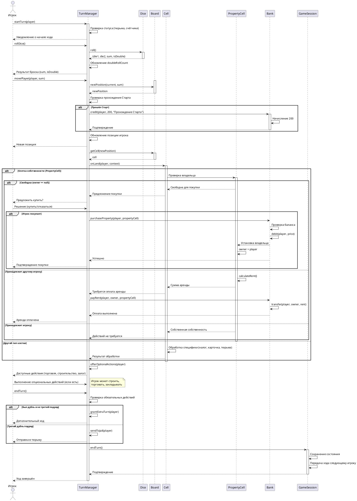

# Диаграмма последовательности: Ход игрока

```plantuml
@startuml
actor "Игрок" as Player
participant "TurnManager" as TM
participant "Dice" as Dice
participant "Board" as Board
participant "Cell" as Cell
participant "PropertyCell" as PC
participant "Bank" as Bank
participant "GameSession" as GS

Player -> TM: startTurn(player)
activate TM
TM -> TM: Проверка статуса (тюрьма, счётчики)
TM --> Player: Уведомление о начале хода

Player -> TM: rollDice()
TM -> Dice: roll()
activate Dice
Dice --> TM: {die1, die2, sum, isDouble}
deactivate Dice
TM -> TM: Обновление doubleRollCount
TM --> Player: Результат броска (sum, isDouble)

Player -> TM: movePlayer(player, sum)
activate Board
TM -> Board: nextPosition(current, sum)
Board --> TM: newPosition
deactivate Board
TM -> TM: Проверка прохождения Старта
alt Прошёл Старт
    TM -> Bank: credit(player, 200, "Прохождение Старта")
    activate Bank
    Bank -> Bank: Начисление 200
    Bank --> TM: Подтверждение
    deactivate Bank
end
TM -> TM: Обновление позиции игрока
TM --> Player: Новая позиция

TM -> Board: getCell(newPosition)
activate Board
Board --> TM: cell
deactivate Board

TM -> Cell: onLand(player, context)
activate Cell

alt Клетка собственности (PropertyCell)
    Cell -> PC: Проверка владельца
    activate PC
    alt Свободна (owner == null)
        PC --> Cell: Свободна для покупки
        Cell --> TM: Предложение покупки
        TM --> Player: Предложить купить?
        Player -> TM: Решение (купить/отказаться)
        alt Игрок покупает
            TM -> Bank: purchaseProperty(player, propertyCell)
            Bank -> Bank: Проверка баланса
            Bank -> Bank: debit(player, price)
            Bank -> PC: Установка владельца
            PC -> PC: owner = player
            Bank --> TM: Успешно
            TM --> Player: Подтверждение покупки
        end
    else Принадлежит другому игроку
        PC -> PC: calculateRent()
        PC --> Cell: Сумма аренды
        Cell --> TM: Требуется оплата аренды
        TM -> Bank: payRent(player, owner, propertyCell)
        Bank -> Bank: transfer(player, owner, rent)
        Bank --> TM: Оплата выполнена
        TM --> Player: Аренда оплачена
    else Принадлежит игроку
        PC --> Cell: Собственная собственность
        Cell --> TM: Действий не требуется
    end
    deactivate PC
else Другой тип клетки
    Cell -> Cell: Обработка специфики (налог, карточка, тюрьма)
    Cell --> TM: Результат обработки
end
deactivate Cell

TM -> TM: offerOptionalActions(player)
TM --> Player: Доступные действия (торговля, строительство, залог)

Player -> TM: Выполнение опциональных действий (если есть)
note right
  Игрок может строить, 
  торговать, закладывать
end note

Player -> TM: endTurn()
TM -> TM: Проверка обязательных действий
alt Был дубль и не третий подряд
    TM -> TM: grantExtraTurn(player)
    TM --> Player: Дополнительный ход
else Третий дубль подряд
    TM -> TM: sendToJail(player)
    TM --> Player: Отправка в тюрьму
end

TM -> GS: endTurn()
activate GS
GS -> GS: Сохранение состояния
GS -> GS: Передача хода следующему игроку
GS --> TM: Подтверждение
deactivate GS

TM --> Player: Ход завершён
deactivate TM

@enduml
```
