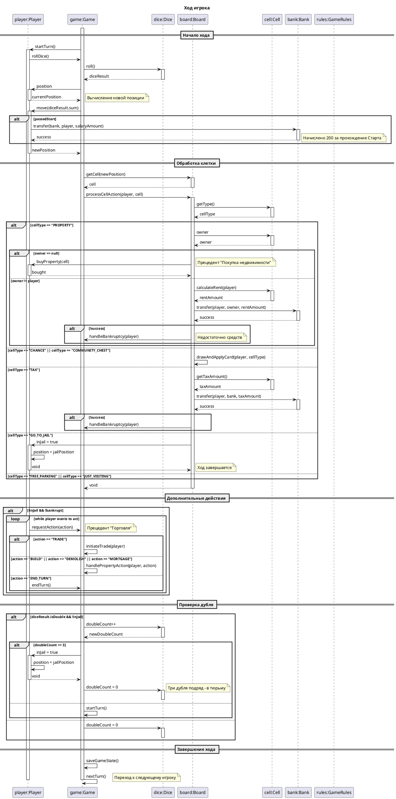

```plantuml
@startuml
title Ход игрока

participant "player:Player" as Player
participant "game:Game" as Game
participant "dice:Dice" as Dice
participant "board:Board" as Board
participant "cell:Cell" as Cell
participant "bank:Bank" as Bank
participant "rules:GameRules" as Rules

== Начало хода ==
activate Game
Game -> Player: startTurn()
activate Player

Player -> Game: rollDice()

Game -> Dice: roll()
activate Dice
Dice --> Game: diceResult
deactivate Dice

Game -> Player: position
activate Player
Player --> Game: currentPosition
deactivate Player

note right: Вычисление новой позиции
Game -> Player: move(diceResult.sum)
activate Player

alt passedStart
    Player -> Bank: transfer(bank, player, salaryAmount)
    activate Bank
    Bank --> Player: success
    deactivate Bank
    note right: Начислено 200 за прохождение Старта
end

Player --> Game: newPosition
deactivate Player

== Обработка клетки ==
Game -> Board: getCell(newPosition)
activate Board
Board --> Game: cell
deactivate Board

Game -> Board: processCellAction(player, cell)
activate Board

Board -> Cell: getType()
activate Cell
Cell --> Board: cellType
deactivate Cell

alt cellType == "PROPERTY"
    Board -> Cell: owner
    activate Cell
    Cell --> Board: owner
    deactivate Cell
    
    alt owner == null
        Board -> Player: buyProperty(cell)
        activate Player
        note right: Прецедент "Покупка недвижимости"
        Player --> Board: bought
        deactivate Player
    else owner != player
        Board -> Cell: calculateRent(player)
        activate Cell
        Cell --> Board: rentAmount
        deactivate Cell
        
        Board -> Bank: transfer(player, owner, rentAmount)
        activate Bank
        Bank --> Board: success
        deactivate Bank
        
        alt !success
            Board -> Game: handleBankruptcy(player)
            note right: Недостаточно средств
        end
    end

else cellType == "CHANCE" || cellType == "COMMUNITY_CHEST"
    note right: Прецедент "Применение карточки действия"
    Board -> Board: drawAndApplyCard(player, cellType)

else cellType == "TAX"
    Board -> Cell: getTaxAmount()
    activate Cell
    Cell --> Board: taxAmount
    deactivate Cell
    
    Board -> Bank: transfer(player, bank, taxAmount)
    activate Bank
    Bank --> Board: success
    deactivate Bank
    
    alt !success
        Board -> Game: handleBankruptcy(player)
    end

else cellType == "GO_TO_JAIL"
    Board -> Player: inJail = true
    activate Player
    Player -> Player: position = jailPosition
    Player --> Board: void
    deactivate Player
    
    note right: Ход завершается

else cellType == "FREE_PARKING" || cellType == "JUST_VISITING"
    note right: Нет действий
end

Board --> Game: void
deactivate Board

== Дополнительные действия ==
alt !inJail && !bankrupt
    loop while player wants to act
        Player -> Game: requestAction(action)
        
        alt action == "TRADE"
            note right: Прецедент "Торговля"
            Game -> Game: initiateTrade(player)
            
        else action == "BUILD" || action == "DEMOLISH" || action == "MORTGAGE"
            note right: Прецедент "Операции с имуществом"
            Game -> Game: handlePropertyAction(player, action)
            
        else action == "END_TURN"
            note right: Игрок завершает ход
            Player -> Game: endTurn()
        end
    end
end

== Проверка дубля ==
alt diceResult.isDouble && !inJail
    Game -> Dice: doubleCount++
    activate Dice
    Dice --> Game: newDoubleCount
    deactivate Dice
    
    alt doubleCount == 3
        Game -> Player: inJail = true
        activate Player
        Player -> Player: position = jailPosition
        Player --> Game: void
        deactivate Player
        
        Game -> Dice: doubleCount = 0
        activate Dice
        deactivate Dice
        
        note right: Три дубля подряд - в тюрьму
    else
        note right: Игрок получает дополнительный ход
        Game -> Game: startTurn()
    end
else
    Game -> Dice: doubleCount = 0
    activate Dice
    deactivate Dice
end

== Завершение хода ==
Game -> Game: saveGameState()

Game -> Game: nextTurn()
note right: Переход к следующему игроку

deactivate Player
deactivate Game

@enduml
```
